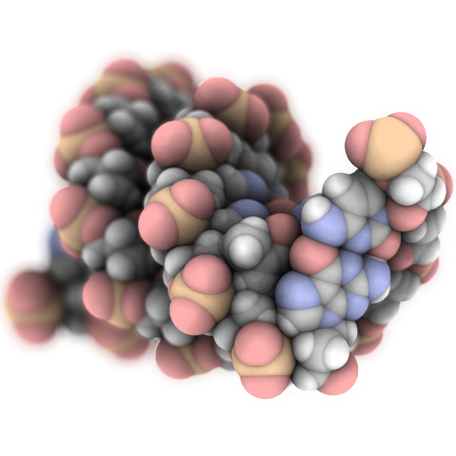
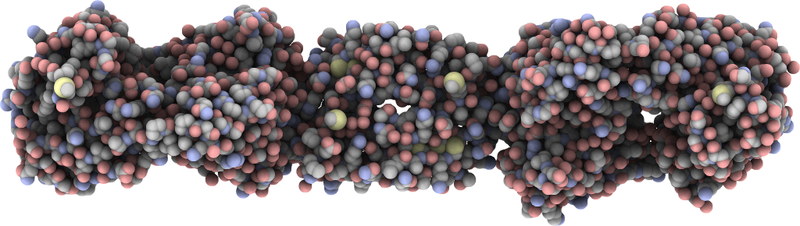
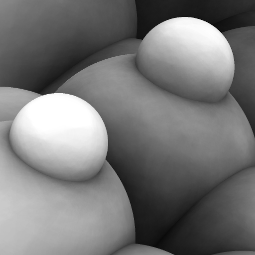
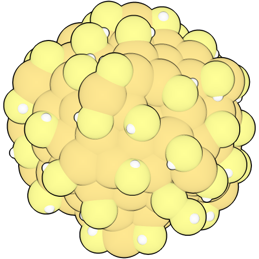
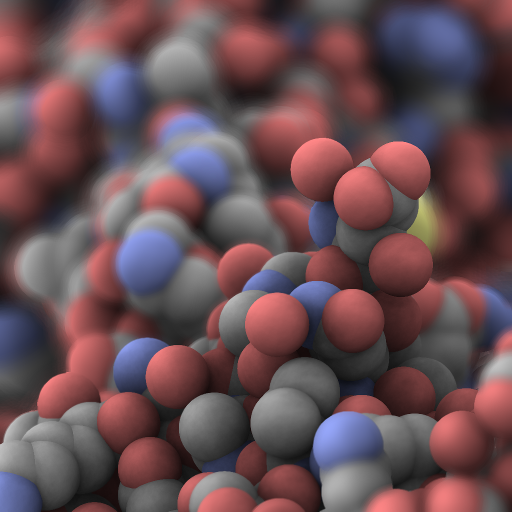
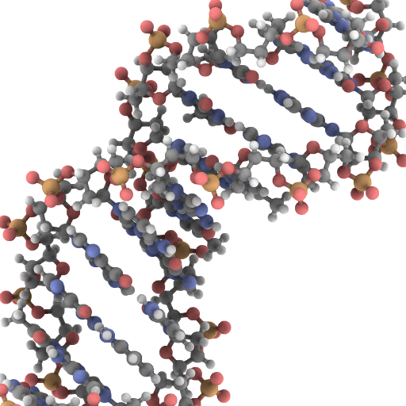
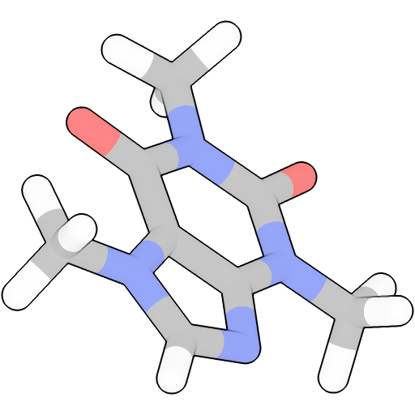
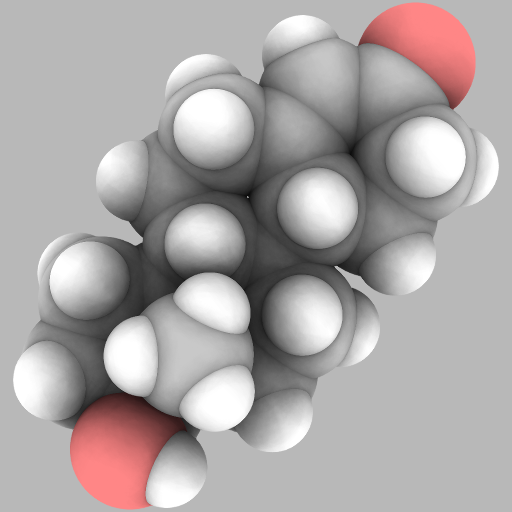
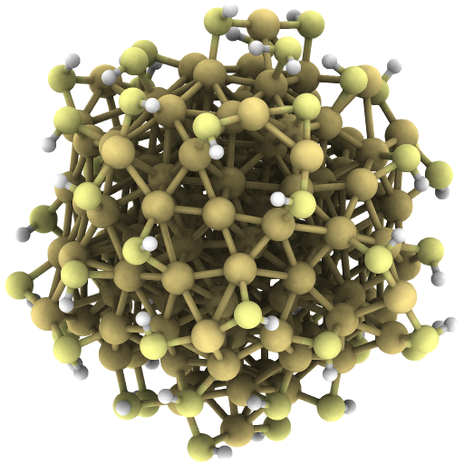
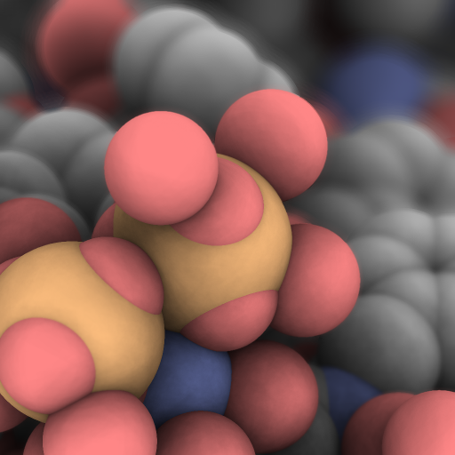

# Atomizer

Atomizer is a molecule renderer with the goal of producing figures that are as attractive as they are practical. Express your molecule clearly _and_ with style.

  

## Try it live

Try Atomizer out live in your browser here: https://www.mechanikadesign.com/webapps/atomizer/demo

## Features

#### Ambient Occlusion

Ambient occlusion provides much more information about molecule structure than simple direct lighting. It's incredibly useful for large and small molecule viewing alike. Easily Atomizer's most important feature.

  

#### Pixel-perfect atoms and bonds

Atomizer renders atoms and bonds not with polygons, but with imposters. This means you can zoom in as close as you like and surfaces remain smooth, not faceted.

  

#### Depth-aware outlines

Atomizer can render atom outlines that are depth-aware. Instead of making your molecule appear to be a collection of flat circles, depth-aware outlines provide cues to the viewer that convey information about the molecular structure.

  

#### Depth of field

Render a more attractive figure while simultaneously drawing your viewer's eye to a region you want to highlight.

  

#### Mix and match rendering options

Atomizer goes to great lengths to decouple rendering options, so that you have the flexibility to present your data in the most clear and attractive way.

  
  
  
  
  

